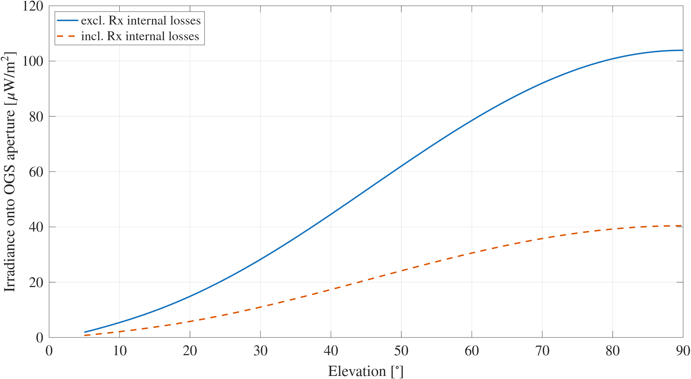
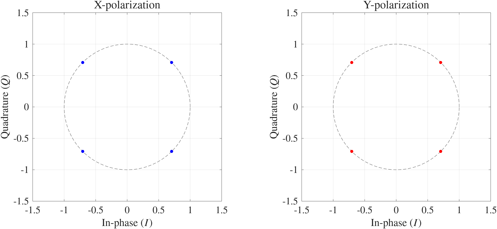
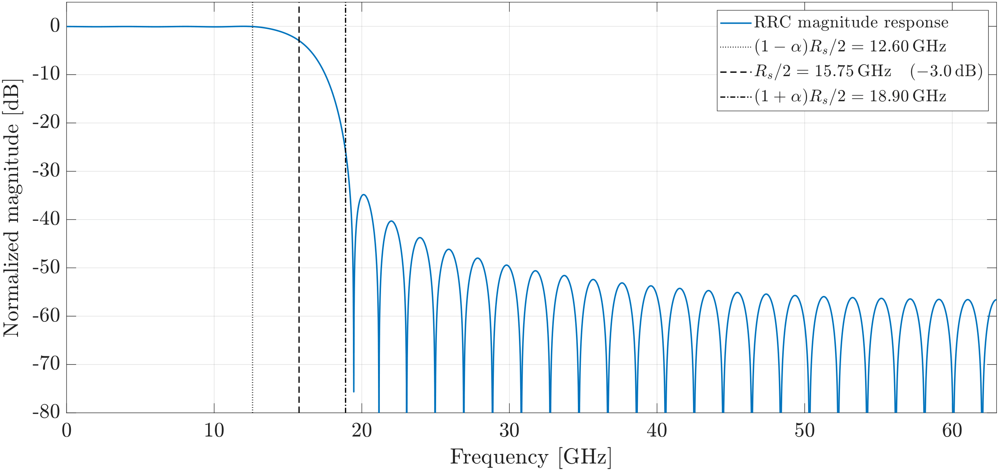
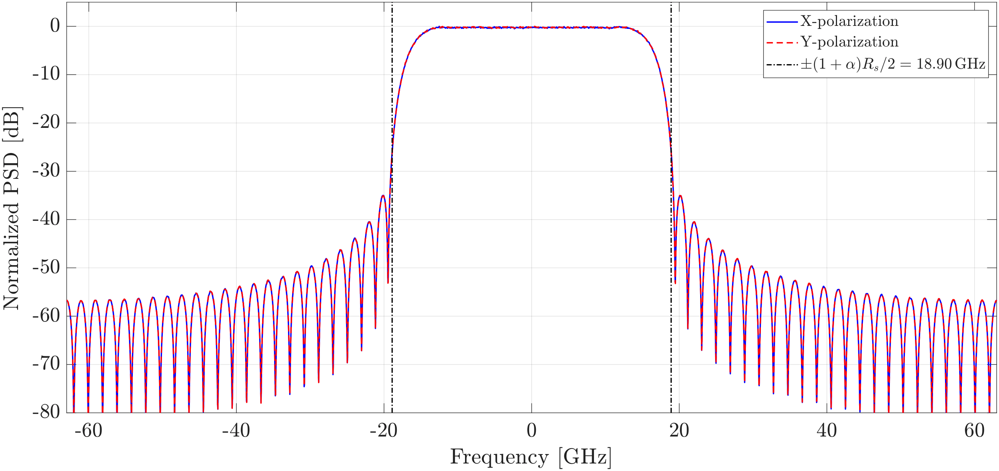
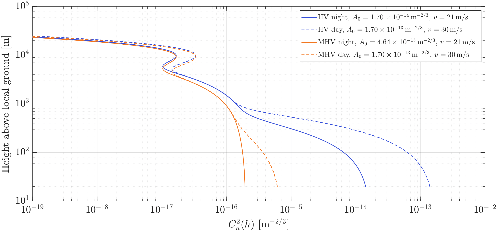
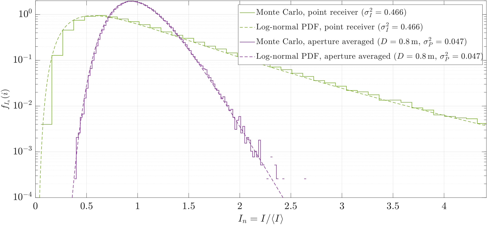
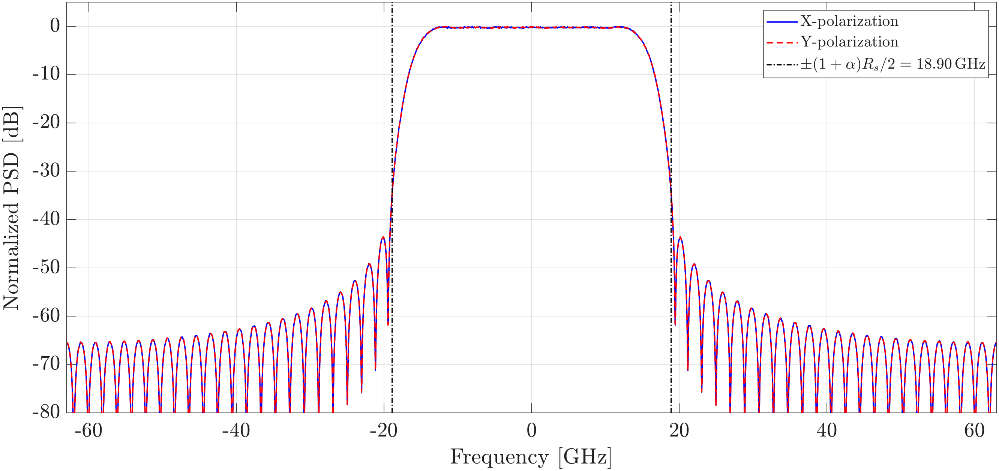
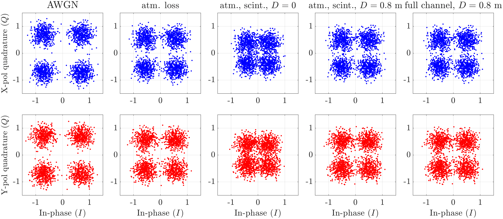
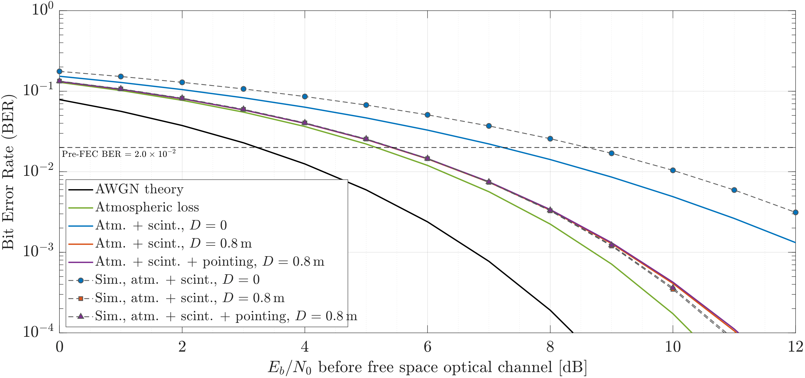

# HydRON FSO Link Simulator

MATLAB link-level simulator for a HydRON-like coherent Dual-Polarization Quadrature Phase Shift Keying (DP-QPSK) Low Earth Orbit (LEO)-to-ground optical wireless link.

This repository contains the simulation code used for my Master's Thesis:

> **Modelling and Simulation of High-Throughput Optical Satellite Links: Application to the ESA HydRON Demonstration System**

The work investigates whether a simplified HydRON-like coherent optical feeder link can satisfy selected ESA ESTOL power and pre-FEC BER requirements under realistic but simplified propagation assumptions.

The simulator combines:

* optical link-budget calculation versus elevation
* coherent DP-QPSK complex-baseband signal generation
* root-raised-cosine (RRC) pulse shaping and matched filtering
* deterministic atmospheric attenuation
* log-normal scintillation
* aperture averaging
* pointing jitter
* BER estimation versus $E_b/N_0$

Although the carrier is optical, the simulation follows the same system-engineering workflow used in RF wireless studies: link budget, propagation/channel modelling, impairment modelling, receiver sensitivity analysis, Monte Carlo evaluation, and BER/threshold comparison.

---

## Repository scope

This repository contains thesis/appendix-level MATLAB code. The scripts are intentionally close to the implementation used to generate the thesis results.

The goal is not to provide a production-ready optical communication simulator, but to document a reproducible link-level study of a high-throughput optical satellite downlink.

---

## System under study

The simulated scenario is a HydRON-like LEO-to-ground optical feeder link using coherent DP-QPSK transmission around the 1550 nm optical window using the ESTOL specifications.

Main assumptions:

| Parameter              |                                      Value |
| ---------------------- | -----------------------------------------: |
| Link type              |             LEO-to-ground optical downlink |
| Modulation             |                                    DP-QPSK |
| Symbol rate            |     31.5 $\mathrm{Gbaud}$ per polarization |
| Raw bit rate           | 126 $\mathrm{Gbit/s}$ before FEC/overheads |
| Wavelength             |                      1554.13 $\mathrm{nm}$ |
| Satellite altitude     |                          530 $\mathrm{km}$ |
| Design elevation       |                                        15º |
| Transmit optical power |                             6 $\mathrm{W}$ |
| Transmit divergence    |                380 $\mu \mathrm{rad}$ FWHM |
| Receiver aperture      |                           0.8 $\mathrm{m}$ |
| Pulse shaping          |      RRC, ($\alpha=0.2$), 4 samples/symbol |
| BER target             |      2.0 $\times10^{-2}$ pre-FEC threshold |

---

## Main scripts

```text
LinkBudget_LEO_ESTOL_OP.m
```

Computes the optical link budget for a HydRON-like LEO-to-ground downlink. It includes:

* LEO slant-range geometry
* Gaussian transmitter gain from FWHM divergence
* receiver aperture gain
* free-space loss
* atmospheric attenuation
* pointing loss
* receiver internal losses
* received power and irradiance versus elevation
* receiver sensitivity from photons per bit
* link margin at the design elevation

```text
DP_QPSK_FSO.m
```

Runs the DP-QPSK physical/link-layer BER simulation. It includes:

* random bit generation for X/Y polarizations
* Gray-coded QPSK mapping
* RRC pulse shaping
* transmit PSD and eye-diagram visualization
* atmospheric attenuation
* log-normal scintillation
* aperture averaging
* pointing jitter
* AWGN
* matched filtering
* symbol decisions and BER estimation
* BER curves versus $E_b/N_0$

---

## Modelled channel impairments

The channel model is intentionally simplified but includes the main scalar effects relevant to the link-budget and BER study:

| Effect                                      | Included            |
| ------------------------------------------- | ------------------- |
| Free-space path loss                        | Yes, in link budget |
| Atmospheric attenuation                     | Yes                 |
| Log-normal scintillation                    | Yes                 |
| Aperture averaging                          | Yes                 |
| Pointing jitter                             | Yes                 |
| AWGN                                        | Yes                 |
| Receiver internal optical losses            | Yes, in link budget |
| FEC                                         | No                  |
| Signal recovery (ARQ)                       | No                  |
| Laser phase noise                           | No                  |
| Polarization tracking / butterfly equalizer | No                  |
| ADC/DAC quantization                        | No                  |
| Nonlinear optical front-end effects         | No                  |
| Adaptive Optics                             | No                  |

The results should be interpreted as a link-level physical-layer study, not as a complete coherent modem implementation.

---

## Results

### Link budget versus elevation

The link-budget simulation computes received irradiance at the Optical Ground Station (OGS) aperture as a function of elevation.



At the design elevation of 15º, the simulated collected aperture power is approximately:

$$
\begin{align}
  P_{\mathrm{OGS}} \approx -23.65 \ \mathrm{dBm}
\end{align}
$$

which is close to the selected ESTOL-like received-power requirement of -23.7 $\mathrm{dBm}$.

The following table summarizes the link-budget result for the HydRON-like LEO-to-ground optical downlink. The scenario assumes a 530 $\mathrm{km}$ LEO satellite, $380 \ \mu\mathrm{rad}$ FWHM transmitter divergence, $6 \ \mathrm{W}$ optical transmit power at $\lambda = 1554.13 \ \mathrm{nm}$, and an $80 \ \mathrm{cm}$ Optical Ground Station telescope aperture at the DLR Oberpfaffenhofen site.

| Parameter                                                               |  15° elevation |         Zenith |
| ----------------------------------------------------------------------- | -------------: | -------------: |
| Mean source power ($p_{\mathrm{Tx}}$)                                     |     +37.78 $\mathrm{dBm}$ |     +37.78 $\mathrm{dBm}$ |
| Tx internal losses ($a_{\mathrm{Tx}}$)                                    |       -0.30 $\mathrm{dB}$ |       -0.30 $\mathrm{dB}$ |
| Tx antenna gain ($g_{\mathrm{Tx}}$)                                       |      +78.85 $\mathrm{dB}$ |      +78.85 $\mathrm{dB}$ |
| Pointing loss ($a_{\mathrm{BW}}$)                                         |       -0.20 $\mathrm{dB}$ |       -0.20 $\mathrm{dB}$ |
| Distance ($L$)                                                            |      1472.8 $\mathrm{km}$ |       529.4 $\mathrm{km}$ |
| Free-space loss ($a_{\mathrm{FSL}}$)                                      |     -261.52 $\mathrm{dB}$ |     -252.63 $\mathrm{dB}$ |
| Atmospheric attenuation ($a_{\mathrm{Atm}}$)                              |       -1.94 $\mathrm{dB}$ |       -0.50 $\mathrm{dB}$ |
| Scintillation loss ($a_{\mathrm{Sci}}$)                                   |            n/a |            n/a |
| Rx antenna gain ($g_{\mathrm{Rx}}$)                                       |     +123.66 $\mathrm{dB}$ |     +123.66 $\mathrm{dB}$ |
| **Power into OGS aperture without Rx losses ($p_{\mathrm{Rx,no,loss}}$)** | **-23.65 $\mathrm{dBm}$** | **-13.33 $\mathrm{dBm}$** |
| Irradiance at OGS aperture without Rx losses                            |    9.647 $\mu W/m^2$ |  103.903 $\mu W/m^2$ |
| Rx internal losses and signal splitting ($a_{\mathrm{Rx}}$)               |       -4.10 $\mathrm{dB}$ |       -4.10 $\mathrm{dB}$ |
| Power after Rx internal losses ($p_{\mathrm{Rx}}$)                        |     -27.75 $\mathrm{dBm}$ |     -17.43 $\mathrm{dBm}$ |
| Irradiance after Rx internal losses                                     |    3.753 $\mu W/m^2$ |   40.423 $\mu W/m^2$ |
| RFE sensitivity ($p_{\mathrm{RFE}}$)                                      |     -40.94 $\mathrm{dBm}$ |     -40.94 $\mathrm{dBm}$ |
| **Photons-per-bit margin**                                              |  **+13.19 $\mathrm{dB}$** |  **+23.51 $\mathrm{dB}$** |


---

### Transmitted DP-QPSK symbols

The transmitted symbols are generated independently for the X and Y polarizations using Gray-coded QPSK.



---

### RRC pulse shaping

The baseband waveform is pulse-shaped using a root-raised-cosine filter with roll-off factor ($\alpha=0.2$), span of 16 symbols, and 4 samples per symbol.



The resulting transmitted spectrum occupies the expected bandwidth around

$$
\begin{align}
  \frac{(1+\alpha)R_s}{2}=18.9 \ \mathrm{GHz}
\end{align}
$$

on each side of complex baseband.



---

### Atmospheric turbulence profiles

The simulator compares Hufnagel-Valley and modified Hufnagel-Valley refractive-index structure parameter profiles ( $C_n^2(h)$ ).



These profiles are used to motivate the turbulence and scintillation assumptions used in the BER simulation.

---

### Log-normal scintillation and aperture averaging

The irradiance fluctuation is modelled using a log-normal distribution. Aperture averaging reduces the received power scintillation index compared with a point receiver.



This captures the reduction in power fluctuations when the received optical field is integrated over a finite telescope aperture.

---

### Received spectrum after channel and matched filtering

The received complex-baseband spectrum is evaluated after the optical channel impairments and receiver matched filter.



---

### Received constellations

The constellation plots show the progressive degradation of the DP-QPSK received symbols as channel impairments are added.



The included cases are:

1. AWGN
2. deterministic atmospheric loss
3. atmosphere + scintillation with point receiver
4. atmosphere + scintillation with aperture averaging
5. full channel including pointing jitter

---

### BER versus $E_b/N_0$

The BER simulation compares the ideal AWGN reference with increasingly complete optical-channel models.



The full-channel BER curve crosses the selected oFEC pre-FEC threshold,

$$
\begin{align}
  \mathrm{BER}_{\mathrm{pre-FEC}} = 2.0\times10^{-2},
\end{align}
$$

at approximately

$$
\begin{align}
  E_b/N_0 \approx 5.5\ \mathrm{dB}.
\end{align}
$$

---

## How to run

Open MATLAB in the repository root and run:

```matlab
LinkBudget_LEO_ESTOL_OP
```

to generate the optical link-budget results.

Then run:

```matlab
DP_QPSK_FSO
```

to generate the DP-QPSK BER simulation results and the associated figures.

The scripts were developed for MATLAB and require functions from the Signal Processing Toolbox and Communications Toolbox.

---

## MATLAB requirements

The code uses MATLAB functions including:

* `pskmod`
* `pskdemod`
* `bit2int`
* `int2bit`
* `rcosdesign`
* `upfirdn`
* `pwelch`
* `qfunc`
* `hann`

Recommended toolboxes:

* Signal Processing Toolbox
* Communications Toolbox

---

## Suggested repository structure

```text
hydron-fso-link-sim/
├── README.md
├── LinkBudget_LEO_ESTOL_OP.m
├── DP_QPSK_FSO.m
├── docs/
│   ├── thesis/
│   │   └── MT_Iker_Aldasoro_UC3M.pdf
│   └── figures/
│       └── png/
│           ├── A01_link_budget.png
│           ├── B01_tx_symbols.png
│           ├── B03_rrc_frequency_response.png
│           ├── B04_tx_spectrum.png
│           ├── B06_hv_vs_mhv_turbulence_profiles.png
│           ├── B07_lognormal_intensity_pdf.png
│           ├── B08_rx_spectrum_full_channel.png
│           ├── B10_constellations.png
│           └── B11_ber_vs_ebn0.png
└── .gitignore
```

---

## Notes on reproducibility

The simulation uses Monte Carlo sampling for the BER and fading-related calculations. For reproducible results, the random seed is fixed inside the MATLAB scripts.

Some parameters are configured for reasonable execution time. Larger Monte Carlo runs can be used to improve statistics in the low-BER region.

---

## Author

**Iker Aldasoro Marculeta**<br>
MSc Telecommunications Engineering<br>
Universidad Carlos III de Madrid

---

## License

This repository is intended for academic and portfolio use. Check the thesis and repository license before reusing figures, text, or code.
